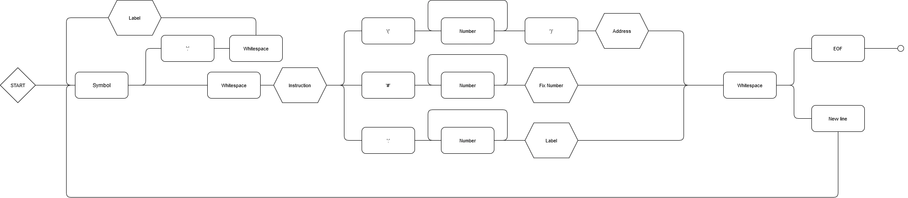

# Assembler simulator FH Aachen

A simulator and compiler for the assembly language used in the Technische Informatik course at FH Aachen - University of Applied Sciences.

This project aim to provide a method to simulate the processor and the assembly language uses in the Technische Informatik course at FH Aachen - University of Applied Sciences.

> [!Note]
> This project is not affiliated with the university.

## How to use

> [!Warning]
> This package is not on crates.io
> The integration through github is required

To use it add to your Cargo.toml

```toml
[dependencies]
asim = { git = "https://github.com/eric-menne/assembler-simulator-fh-aachen" }
```

## Commands

| Instruction | Operant         | Description                                                                       |
| ----------- | --------------- | --------------------------------------------------------------------------------- |
| NOP         | \* (don't care) | No operation                                                                      |
| LDA         | #n              | Load the accumulator with the value n                                             |
| LDA         | (n)             | Load the accumulator with the contents of the memory location n                   |
| STA         | (n)             | Transfer the contents of the accumulator to the memory location n                 |
| ADD         | #n              | Increase the contents of the accumulator by the value n                           |
| ADD         | (n)             | Increase the contents of the accumulator by the contents of the memory location n |
| SUB         | #n              | Decrease the contents of the accumulator by the value n                           |
| SUB         | (n)             | Decrease the contents of the accumulator by the contents of the memory location n |
| JMP         | n               | Load the instruction pointer with the value n                                     |
| BRZ         | #n              | Add n to the instruction pointer if the zero bit is set                           |
| BRC         | #n              | Add n to the instruction pointer if the carry bit is set                          |
| BRN         | #n              | Add n to the instruction pointer if the negative bit is set                       |

### Labels

The `JMP` command requires an absolute value, which is why the `label` has been introduced. This label can be used as a prefix before an instruction, allowing for easy jumps to different commands. Labels can be placed either on a line before the instruction or on the same line.

## Example syntax

This syntax example illustrates how the assembly language syntax functions.

```text
    LDA #3
start:
    BRZ 4
    STA (1)
    SUB #1
    JMP start
    NOP 0
```

### Syntax diagram

To further understand how the syntax work I included a diagram that was used to develop the parser.


